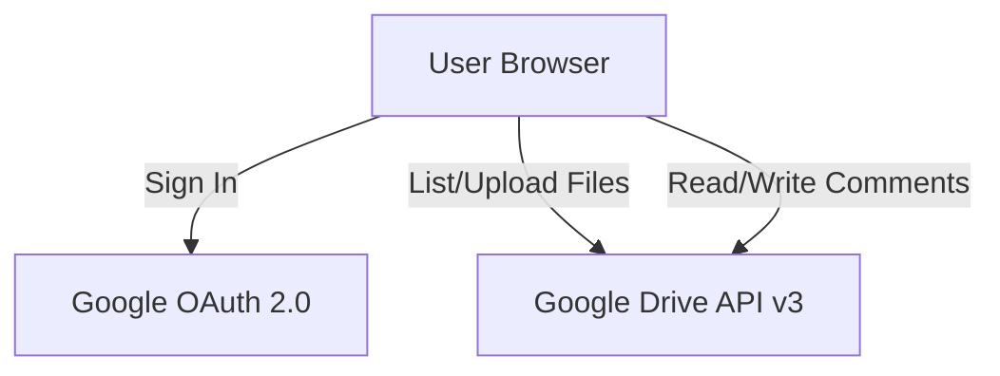

# Mim - Community Memory Design Document

## 1. Overview
**Mim** is a web-based "Community Memory" gallery designed for a Mongolian community to preserve and share moments from the past year. It allows members to view photos and videos, upload new memories, and engage through comments.

## 2. Core Philosophy
- **Simplicity**: No complex registration. Uses existing Google Accounts.
- **Ownership**: Data is stored in a community-owned Google Drive folder (`mim@gmail.com`), not a proprietary database.
- **Authenticity**: Design reflects a warm, premium community feel using "Glassmorphism" aesthetics.

## 3. Architecture

### 3.1 "Serverless" Client-Side Model
The application runs entirely in the browser (Client-Side) without a dedicated backend server. It communicates directly with Google APIs.

### 3.2 Key Components
*   **Authentication**: Google OAuth 2.0 (Implicit Flow for Client-side).
    *   Scope: `drive.file` (Access only files created/opened by app) or `drive` (Full access).
    *   *Note: Current implementation uses `drive.file` and relies on a Shared Folder.*
*   **Storage**: Google Drive.
    *   Central Shared Folder (owned by Admin).
    *   All media (Images, Videos) stored here.
*   **Database**: None. Google Drive metadata (File ID, Name, Comments) serves as the database.

## 4. User Interface (UI/UX)

### 4.1 Design Language: "Mongolian Sky Glass"
*   **Background**: Deep gradient (Deep Blue #0f172a to Slate #1e293b), representing the night sky or deep depth.
*   **Elements**: Translucent "Glass" panels (`backdrop-filter: blur(12px)`).
*   **Accents**: 
    *   **Sky Blue (`#38bdf8`)**: Represents the Eternal Blue Sky.
    *   **Gold (`#fbbf24`)**: Represents ornaments and warmth.
*   **Typography**: `Inter` (Clean, modern sans-serif).

### 4.2 Key Screens
1.  **Login Screen**: 
    *   Centered Glass Card.
    *   "Sign in with Google" button.
    *   "Demo Mode" option for guests without setup.
2.  **Memory Grid (Main)**:
    *   Masonry-style responsive grid.
    *   Images/Videos displayed as square thumbnails.
    *   Hover effects showing file names.
    *   Floating "Upload" button (Bottom Right).
3.  **Memory Detail (Modal)**:
    *   Large preview of Image or Video.
    *   Sidebar with metadata (Uploader Name).
    *   **Comment Section**: Scrollable list of comments + Input field.

## 5. Implementation Details

### 5.1 Technology Stack
*   **Framework**: React 18 + Vite
*   **Language**: JavaScript (ES6+)
*   **Styling**: Vanilla CSS (Variables, Flexbox, Grid)
*   **Icons**: `lucide-react`
*   **Animations**: `framer-motion`
*   **Google Library**: `@react-oauth/google`

### 5.2 Environment Configuration
Required `.env` variables:
*   `VITE_GOOGLE_CLIENT_ID`: OAuth 2.0 Client ID for Web Application.
*   `VITE_DRIVE_FOLDER_ID`: The ID of the Google Drive folder where memories are stored.

### 5.3 Data Flow
1.  **Init**: App loads, checks for Auth Token in memory.
2.  **Login**: User redirects/popups via Google. Token received.
3.  **Fetch**: `useDrive` hook calls `drive.files.list` with query: `'FOLDER_ID' in parents`.
4.  **Display**: Files rendered in Grid.
5.  **Comment**: `useComments` hook lists/creates comments on specific `fileId`.

## 6. Future Considerations
*   **Pagination**: Currently fetches up to 100 items. Need `nextPageToken` implementation for larger libraries.
*   **Video Streaming**: currently relies on `webViewLink` or direct download. Better streaming integration could be added.
*   **Offline Support**: Caching thumbnails for faster load.
